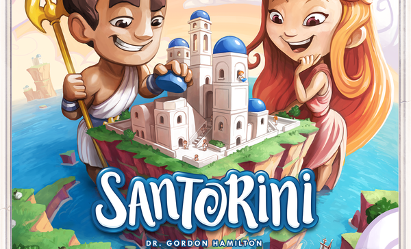

# Prova Finale di Ingegneria del Software - AA 2019-2020


Implementazione del gioco da tavolo [Santorini](http://www.craniocreations.it/prodotto/santorini/).

Il progetto consiste nell’implementazione di un sistema distribuito composto da un singolo server in grado di gestire una partita alla volta e multipli client (uno per giocatore) che possono partecipare ad una sola partita alla volta utilizzando il pattern MVC (Model-View-Controller).
La rete è stata gestita con l'utilizzo delle socket.

Interazione e gameplay: linea di comando (CLI) e grafica (GUI).

## Documentazione

### UML
I seguenti diagrammi delle classi rappresentano rispettivamente il modello iniziale sviluppato durante la fase di progettazione e i diagrammi del prodotto finale nelle parti critiche riscontrate.
- [UML Iniziali](https://github.com/snegrini/ing-sw-2020-kala-lanzi-negrini/tree/master/deliveries/archive/uml/uml_model_initial.jpg)
- [UML Finali](https://github.com/snegrini/ing-sw-2020-kala-lanzi-negrini/tree/master/deliveries/final/uml)

### JavaDoc
La seguente documentazione include una descrizione per la maggior parte delle classi e dei metodi utilizzati, segue le tecniche di documentazione di Java e può essere consultata al seguente indirizzo: [Javadoc](https://github.com/snegrini/ing-sw-2020-kala-lanzi-negrini/tree/master/deliveries/final/javadoc)

### Coverage report
Al seguente link è possibile consultare il report della coverage dei test effettuati con Junit: [Report](https://github.com/snegrini/ing-sw-2020-kala-lanzi-negrini/tree/master/deliveries/final/report)


### Librerie e Plugins
|Libreria/Plugin|Descrizione|
|---------------|-----------|
|__Maven__|Strumento di automazione della compilazione utilizzato principalmente per progetti Java.|
|__JavaFx__|Libreria grafica per realizzare interfacce utente.|
|__JUnit__|Framework di unit testing.|

## Funzionalità
### Funzionalità Sviluppate
- Regole Complete
- CLI
- GUI
- Socket
- 2 FA (Funzionalità Avanzate):
    - __Persistenza:__ lo stato di una partita deve essere salvato su disco, in modo che la partita possa riprendere anche a seguito dell’interruzione dell’esecuzione del server.
    - __Undo:__ permette a un giocatore di annullare la propria mossa entro un periodo di 5 secondi da quando l’ha effettuata.


## Compilazione e packaging
I jar sono stati realizzati con l'ausilio di Maven Shade Plugin.
Di seguito sono forniti i jar precompilati.
Per compilare i jar autonomamente, posizionarsi nella root del progetto e lanciare il comando:
```
mvn clean package
```
I jar compilati verranno posizionati all'interno della cartella ```target/``` con i nomi
```santorini-client.jar``` e ```santorini-server.jar```.

### Jars
I Jar del progetto possono essere scaricati al seguente link: [Jars](https://github.com/snegrini/ing-sw-2020-kala-lanzi-negrini/tree/master/deliveries/final/jar).


## Esecuzione
Questo progetto richiede una versione di Java 11 o superiore per essere eseguito correttamente.

### Santorini Client
Le seguenti istruzioni descrivono come eseguire il client con interfaccia CLI o GUI.

#### CLI
Per lanciare Santorini Client CLI digitare da terminale il comando:
```
java -jar santorini-client.jar --cli
```
#### GUI
Per poter lanciare la modalità GUI sono disponibili due opzioni:
- effettuare doppio click sull'eseguibile ```santorini-client.jar```
- digitare da terminale il comando:
```
java -jar santorini-client.jar
```

### Santorini Server
Per lanciare Santorini Server digitare da terminale il comando:
```
java -jar santorini-server.jar [--port <port_number>]
```
#### Parametri
- `--port` `-p` : permette di specificare la porta del server. Se non specificato il valore di default è __16847__;

## Componenti del gruppo
- [__Samuel Kala__](https://github.com/samuelkala)
- [__Andrea Lanzi__](https://github.com/AndreaLanzi-PoliMi)
- [__Samuele Negrini__](https://github.com/snegrini)
